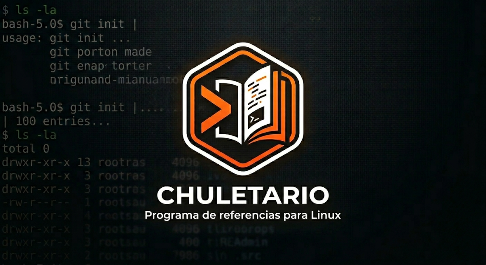

# Chuletario

Esto no es más que una chuleta interactiva de comandos Linux para administración de sistemas. Consulta, busca, añade y edita entradas organizadas por categorías, exporta a Markdown o PDF y gestiona todo desde la terminal con una interfaz CLI enriquecida o una TUI visual. Algo fácil de usar y fácilmente ampliable.

## Características

- **Más de 420 comandos** repartidos en 12 categorías (redes, sistema, logs, paquetes, usuarios, archivos, etc.) que he ido metiendo yo mismo durante algunos cursos que he realizado.
- **Menú CLI** con tablas y colores ([Rich](https://github.com/Textualize/rich))
- **Interfaz TUI** para navegar, filtrar por categoría y ver el detalle de cada comando ([Textual](https://github.com/Textualize/textual))
- **Búsqueda** por nombre, descripción, ejemplo o notas
- **CRUD completo**: añadir, editar y eliminar comandos (los cambios se guardan en JSON)
- **Advertencias**: notas personalizadas, marca de comando peligroso y detección automática de ejemplos delicados (`rm`, `dd`, etc.)
- **Ayuda integrada**: manual del comando (`man` en Linux/macOS; navegador o WSL en Windows) y enlace opcional a documentación externa
- **Exportación** a Markdown y PDF
- **Datos modulares**: un archivo JSON por área en `modules/` (fácil de mantener y versionar)
- **Launcher `run_app.py`**: crea el entorno virtual, instala dependencias si faltan y arranca la app sin configurar nada a mano (ideal en Windows y para quien clona el repo por primera vez)

## Requisitos

- Python 3.10 o superior (solo el intérprete del sistema; el resto lo gestiona `run_app.py`)
- Dependencias en `requirements.txt`: [Rich](https://github.com/Textualize/rich), [Textual](https://github.com/Textualize/textual), [ReportLab](https://www.reportlab.com/)

## Instalación y arranque

Clona el repositorio y ejecuta el launcher. **No hace falta** crear el venv ni ejecutar `pip install` manualmente.

```bash
git clone https://github.com/entreunosyceros/chuletario.git
cd chuletario
python run_app.py
```

En Linux o macOS también vale `python3 run_app.py`. En Windows: `py run_app.py`, o doble clic en `run_app.py` si los archivos `.py` están asociados a Python.

### Qué hace `run_app.py`

El script prepara todo y abre Chuletario en el entorno virtual `.venv` (no necesitas activarlo tú):

| Paso | Acción |
|------|--------|
| 1 | Comprueba si existe `.venv` con su Python interno |
| 2 | Si **no existe**, crea el entorno virtual y actualiza `pip` |
| 3 | Comprueba si las dependencias de `requirements.txt` están instaladas (importa `rich`, `textual`, `reportlab` y compara un marcador si el archivo cambió) |
| 4 | Si **faltan** o cambiaste `requirements.txt`, ejecuta `pip install -r requirements.txt` |
| 5 | Lanza `main.py` con el Python de `.venv` |

La carpeta `.venv` queda en la raíz del proyecto. Si modificas `requirements.txt`, el launcher detectará el cambio y reinstalará lo necesario en el siguiente arranque.

### Arranque manual (opcional)

Si prefieres gestionar el entorno tú mismo:

```bash
python -m venv .venv
# Windows:  .venv\Scripts\activate
# Linux/mac: source .venv/bin/activate
pip install -r requirements.txt
python main.py
```

Los módulos JSON se resuelven por la ubicación del proyecto; no hace falta estar dentro de la carpeta `chuletario` al usar `run_app.py` o `main.py`.

### Windows

Chuletario Pro funciona en **Windows 10/11** con Python 3.10+:

- **`run_app.py` es la forma más cómoda**: crea `.venv` en `Scripts\python.exe`, instala dependencias y abre la app sin comandos extra.
- Usa la **Terminal de Windows**, **Windows Terminal** o PowerShell (recomendado para la TUI y los colores).
- Los archivos `modules/*.json` se cargan con rutas absolutas: no hace falta estar en la carpeta del proyecto.
- **Ver ayuda (man)**: si no tienes WSL, se abre la documentación en el navegador (man7.org). Con [WSL](https://learn.microsoft.com/windows/wsl/) instalado, se intenta `wsl man` primero.
- **Ejecutar comando** (`E`): lanza el comando en tu shell de Windows (`cmd`/`PowerShell`). Los ejemplos Linux (`grep`, `systemctl`, etc.) solo funcionan en WSL o en un entorno tipo Unix; la chuleta sigue siendo útil para consultar y editar.
- Si ves caracteres raros, usa Windows Terminal o ejecuta antes: `chcp 65001` (UTF-8).

### Menú CLI

| Tecla | Acción |
|-------|--------|
| `1`–`11` | Ver comandos de una categoría |
| `B` | Buscar |
| `E` | Ejecutar un comando en la shell |
| `A` | Añadir comando |
| `D` | Editar comando |
| `X` | Eliminar comando |
| `M` | Exportar Markdown |
| `P` | Exportar PDF |
| `R` | Recargar módulos JSON |
| `T` | Abrir interfaz TUI |
| `C` | Créditos |
| `0` | Salir |

### Interfaz TUI

Pulsa **T** en el menú principal. Podrás:

- Filtrar por categoría y buscar en tiempo real
- Ver el detalle del comando seleccionado en un panel lateral
- Usar **Ver ayuda (man)** y **Abrir docs** cuando haya URL configurada
- Añadir, editar y eliminar entradas con formularios en pantalla

## Estructura del proyecto

```
chuletario/
├── main.py                 # Punto de entrada
├── run_app.py              # Launcher (venv + pip + arranque)
├── requirements.txt        # Dependencias Python
├── README.md
├── LICENSE                 # Licencia MIT
├── .gitignore
├── .venv/                  # Entorno virtual (se crea al usar run_app.py; no en git)
├── img/
│   └── Chuletario.png      # Imagen del repositorio
├── modules/                # Datos: un JSON por área (solo comandos)
│   ├── almacenamiento.json
│   ├── archivos.json
│   ├── backups.json
│   ├── bash.json
│   ├── logs.json
│   ├── paquetes.json
│   ├── permisos.json
│   ├── procesos.json
│   ├── redes.json
│   ├── servicios.json
│   ├── sistema.json
│   └── usuarios.json
└── app/                    # Código Python
    ├── __init__.py
    ├── paths.py            # Rutas del proyecto (multiplataforma)
    ├── platform.py         # Ajustes de consola (UTF-8, ANSI en Windows)
    ├── constants.py        # Constantes, créditos, reglas de peligro
    ├── console.py          # Consola Rich y pausas
    ├── storage.py          # Carga y guardado de modules/*.json
    ├── items.py            # Campos opcionales y búsqueda en entradas
    ├── ayuda.py            # man, documentación web, créditos
    ├── advertencias.py     # Avisos explícitos e inferidos
    ├── catalog.py          # Categorías, resolvers y ayudas CLI
    ├── crud.py             # Crear, editar, eliminar, duplicados
    ├── cli/
    │   ├── __init__.py
    │   ├── menu.py         # Menú principal
    │   └── actions.py      # Buscar, exportar, CRUD, créditos…
    └── tui/
        ├── __init__.py
        ├── forms.py        # Modales (añadir, editar, duplicados, créditos)
        └── app.py          # Aplicación Textual (tabla, filtros, detalle)
```

Los **JSON de comandos** (`modules/`) están separados del **código** (`app/`) para facilitar el mantenimiento: puedes ampliar la chuleta editando solo los `.json` o colaborar en categorías concretas sin tocar la aplicación.

## Formato de una entrada en JSON

```json
{
    "comando": "ss",
    "descripcion": "Sockets y conexiones de red",
    "ejemplo": "ss -tulpn",
    "notas": "Requiere privilegios para ver todos los procesos",
    "peligro": false,
    "docs": "https://man7.org/linux/man-pages/man8/ss.8.html"
}
```

Los campos `notas`, `peligro` y `docs` son opcionales.

## Licencia y autor

Este proyecto está bajo la licencia **MIT**. Consulta el archivo [LICENSE](LICENSE) para el texto completo.

Creado por **[entreunosyceros](https://github.com/entreunosyceros)** con ☕ y 🚬

Repositorio: [github.com/entreunosyceros/chuletario](https://github.com/entreunosyceros/chuletario)

